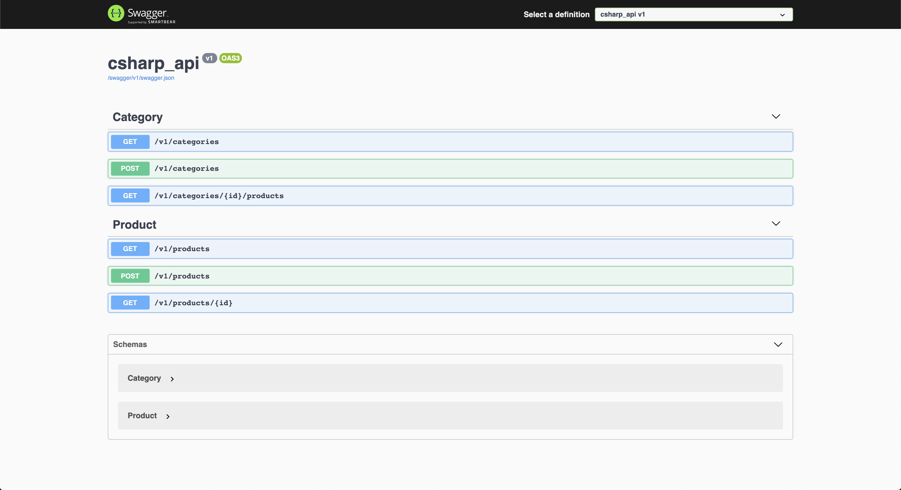

# dotnet-core-api

An API created with .NET Core 5 and Entity Framework (in memory).

Created from the video on YouTube: https://www.youtube.com/watch?v=but7jqjopKM

## Pre-requisites

I will assume that you have the following tools installed and configured:

- [Docker](https://docs.docker.com/get-docker/): v20.10.2 or higher.
- [docker-compose](https://docs.docker.com/compose/install/): v1.27.4 or higher.

## Up And Running

Just run the command below:

```bash
$ docker-compose up -d
```

Access the address to access the application Swagger:

- http://localhost:5001/swagger/index.html


